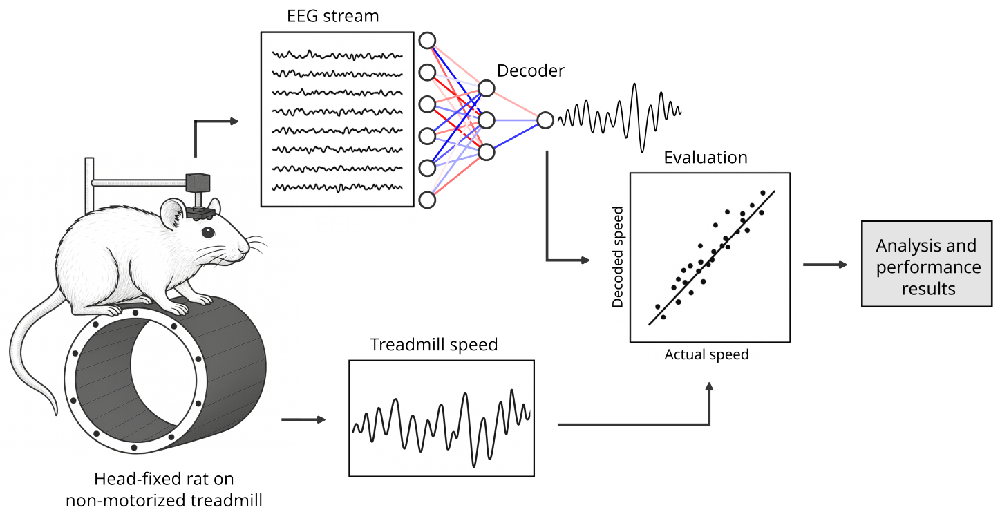

# Rat locomotion neural decoding

Code repository for paper: **"Online decoding of rat self-paced locomotion speed from EEG using recurrent neural networks"**.



This repository contains:
- **Experiment scripts** that train and evaluate multiple decoders.
- **Figure scripts** that regenerate plots used in the paper from saved result tables.
- **Data-processing** pipeline shared across experiments.

## Repository layout

```
rat-locomotion-decoding/
  data/
    exclusions.npy
  experiments/
    exp01_benchmark.py
    exp02_transfer_learning.py
    exp03_localized.py
    exp04_frequency_bands.py
    exp05_predictions.py
  figures/
    model_selection.py
    transfer_learning.py
    localized.py
    frequency_bands.py
    predictions.py
  header/
    md_header.png
  models/
    decoders.py
    __init__.py
  utils/
    loaders.py
    processors.py
    metrics.py
    random.py
    __init__.py
  results/
    autocorrelations.npy
  tests/
    stats.py
```

Key conventions:
- Experiments read raw session files from `data/` and write `results/*.csv` summary tables.
- Figure scripts read output data from `results/`.

## Data layout and format

### What goes in `data/`
All experiments expect:
- `data/exclusions.npy` (already included here)
- One file per session per rat in `data/`.

Each session file is opened via `h5py.File(...)` in `utils/loaders.py`, which means the expected session format is **HDF5** (commonly MATLAB v7.3 `.mat` files).

### Expected HDF5 structure
`utils/loaders.load_data()` expects a dataset named `Data_eeg` that behaves like a MATLAB-style cell array, where:
- Column 1: Rat ID (stored as an object array of character codes)
- Column 3: EEG array
- Column 4: EEG timestamps
- Column 5: treadmill speed
- Column 6: speed timestamps

See: `utils/loaders.py`.

### Inclusion/exclusion
All experiment scripts load `data/exclusions.npy` and drop any session filenames found there. See inclusion criteria in the method's section of the paper.

## How the pipeline works

Across experiments, the main flow is:

1. Load raw data with `utils/loaders.load_data(session_file)`.
2. Build a `utils/processors.Dataset`:
   - Downsample EEG to the speed timestamps via linear interpolation.
   - Convert speed to `abs(speed * 1e5)` for numerical stability.
   - Split sequentially into train/val/test.
   - Z-score EEG per channel using training statistics.
   - Build sliding windows (default `seq_size=20`).
3. Train a decoder from `models/decoders.py`.
4. Evaluate on test windows using:
   - Pearson correlation (`r`)
   - Coefficient of determination (`R^2`)

## Running experiments

All commands below assume you run them from the repository root.

Note on outputs:
- The experiment scripts write `*.csv` to an existing folder `results` (included in the repo).
- Figure scripts read from `results/`.

### Experiment summary

| ID | Script | What it produces | Run command | Output files (written to CWD) |
|---:|---|---|---|---|
| 01 | `experiments/exp01_benchmark.py` | Benchmark / model selection across sessions for 5 decoders | `python3 -m experiments.exp01_benchmark` | `model_selection_correlation.csv`, `model_selection_r2_score.csv` |
| 02 | `experiments/exp02_transfer_learning.py` | Cross-session and cross-subject transfer learning with the RNN | `python3 -m experiments.exp02_transfer_learning` | `transfer_learning_correlation.csv`, `transfer_learning_r2_score.csv` |
| 03 | `experiments/exp03_localized.py` | Region-only and region-pair decoding with the RNN | `python3 -m experiments.exp03_localized` | `localized_correlation.csv`, `localized_r2_score.csv` |
| 04 | `experiments/exp04_frequency_bands.py` | Band-limited decoding (delta/theta/alpha/beta/gamma) with the RNN | `python3 -m experiments.exp04_frequency_bands` | `frequency_bands_correlation.csv`, `frequency_bands_r2_score.csv` |
| 05 | `experiments/exp05_predictions.py` | Past/future prediction horizons (EEG-based vs speed-based baseline) | `python3 -m experiments.exp05_predictions` | `predictions_{forward|reversed}_{0|10|20|50|100}_{correlation|r2_score}.csv` |

## Regenerating figures

All figure scripts assume the corresponding `results/*.csv` files exist.

| Figure script | Reads | Run command | Output image(s) |
|---|---|---|---|
| `figures/model_selection.py` | `results/model_selection_*.csv` | `python3 -m figures.model_selection` | `model_correlations.png`, `model_determination.png` |
| `figures/transfer_learning.py` | `results/transfer_learning_*.csv` | `python3 -m figures.transfer_learning` | `transfer_learning_corr.png`, `transfer_learning_r2.png` |
| `figures/localized.py` | `results/localized_*.csv` | `python3 -m figures.localized` | `region_pairs_corr.png`, `region_pairs_r2.png` |
| `figures/frequency_bands.py` | `results/frequency_bands_*.csv` and raw data for PSD plot | `python3 -m figures.frequency_bands` | `frequencies_correlations.png`, `frequencies_determination.png`, `eeg_power_spectra_speeds.png` |
| `figures/predictions.py` | `results/predictions_*.csv` and `results/autocorrelations.npy` | `python3 -m figures.predictions` | `forward_predictions.png`, `reversed_predictions.png` |

## Decoder architectures

Decoder implementations (architectures + hyperparameters) live in:

- `models/decoders.py`

If you are interested in hyperparameters, see summary tables below.

### Input representations
The `Dataset.build(seq_size=20, mode=...)` method generates sliding windows:
- `mode="sequence"`: `X` has shape `(n_windows, seq_size, n_channels)`
- `mode="tabular"`: `X` has shape `(n_windows, seq_size * n_channels)`

In the default paper setting (`seq_size=20`, `n_channels=32`):
- Tabular feature size = 20 * 32 = 640

### Linear regression (LinReg)
- Library: `sklearn.linear_model.LinearRegression`
- Baseline linear model over tabular window features.

### Random forest (RandForest)
- Library: `sklearn.ensemble.RandomForestRegressor`
- Hyperparameters (see `models/decoders.py` for full details):
  - `n_estimators=300`
  - `max_depth=10`
  - `bootstrap=True`
  - `max_features=1.0`

### Feed-forward neural network (FNN)
`Keras` sequential model over tabular window features.

| Order | Layer | Units / Params | Activation | Notes |
|:---:|:---:|:---:|:---:|:---:|
| 1 | Input | 640 | - | Flattened window: seq_size * n_channels |
| 2 | Dense | 64 | ReLU | `hidden1` |
| 3 | Dropout | 0.20 | - | `dropout1` |
| 4 | Dense | 32 | ReLU | `hidden2` |
| 5 | Dropout | 0.15 | - | `dropout2` |
| 6 | Dense | 32 | ReLU | `hidden3` |
| 7 | Dropout | 0.10 | - | `dropout3` |
| 8 | Dense | 1 | Linear | Output speed |

Training settings:
- Optimizer: Adam (`lr=1e-3`)
- Loss: MSE
- Epochs: 50
- Batch size: 32
- Validation: `ModelCheckpoint` + `EarlyStopping`

### Recurrent neural network (RNN)
`Keras` two-layer LSTM encoder + dense regression head.

| Order | Layer | Units / Params | Notes |
|:---:|:---:|:---:|:---:|
| 1 | Input | (seq_len, n_channels) | Sequence window (default seq_len=20) |
| 2 | LSTM | 128 | `return_sequences=True` |
| 3 | LayerNorm | - | Stabilizes recurrent activations |
| 4 | LSTM | 64 | Final sequence-to-vector |
| 5 | LayerNorm | - | |
| 6 | Dense | 64 | ReLU |
| 7 | Dropout | 0.10 | |
| 8 | Dense | 32 | ReLU |
| 9 | Dropout | 0.10 | |
| 10 | Dense | 1 | Linear output |

Training settings:
- Optimizer: Adam (`lr=1e-3`)
- Loss: MSE
- Epochs: 25
- Batch size: 32
- Validation: `ModelCheckpoint` + `EarlyStopping`

Fine-tuning:
- `RNN.fine_tune(...)` optionally freezes LSTM layers and trains only the dense head wiht lower learning rate.

### Encoder-only Transformer
`Keras` encoder stack + Conv1D + dense regression head.

High-level blocks:

| Block | Layers | Notes |
|:---:|:---:|:---:|
| Token projection | Dense(d_model=128) | Projects each time step from n_channels to d_model |
| Positional embedding | Embedding(seq_len, d_model) + Add | Learned positional encoding |
| Encoder stack | Repeated `num_encoder_layers=2` times | Each block: MHA + residual + LN, then FFN + residual + LN |
| Context convolution | Conv1D(filters=32, kernel_size=3, padding=same) | Adds local context after attention |
| Head | Flatten -> Dense(16) -> Dropout -> Dense(8) -> Dropout -> Dense(1) | Regression |

Encoder block details (per layer):
- MultiHeadAttention: `num_heads=4`, `key_dim=d_model/num_heads`
- FFN: `Dense(ff_dim=64, ReLU)` then `Dense(d_model)`

Training settings:
- Optimizer: Adam (`lr=1e-3`)
- Loss: MSE
- Epochs: 25
- Batch size: 32
- Validation: `ModelCheckpoint` + `EarlyStopping`

## Statistical tests

`tests/stats.py` is a statistical analysis script that:
- Runs Shapiro-Wilk normality checks.
- Runs Friedman tests across multiple decoders.
- Runs pairwise Wilcoxon signed-rank tests with Bonferroni correction.
- Writes all tables to an Excel file.

Run:

```bash
python3 -m tests.stats
```

Output:
- `decoder_statistical_tests.xlsx`

## Citation

If you use this code, please cite the associated paper:

- De Miguel et al., Online decoding of rat self-paced locomotion speed from EEG using recurrent neural networks (2026).